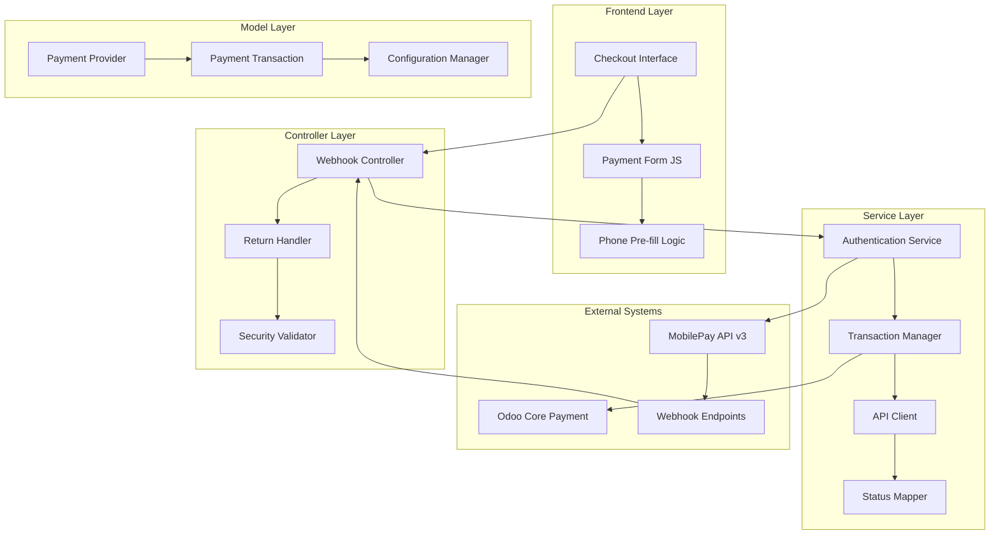
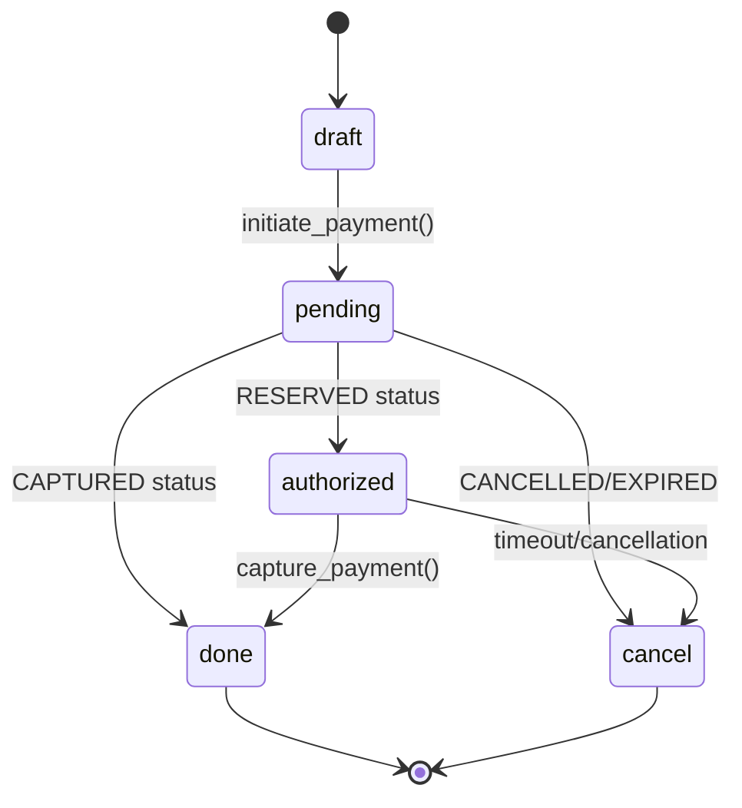

# Design Document: Odoo MobilePay Integration

## Overview

This design document outlines the architecture for integrating Vipps MobilePay ePayment API v3 with Odoo 17, creating a comprehensive payment provider module for the Danish market. The solution implements a secure, scalable payment system supporting authorize & capture flows, immediate payments, refunds, and real-time webhook processing.

The module extends Odoo's native payment framework while maintaining compatibility with both Enterprise and Community editions. Key architectural decisions prioritize security through encrypted credential storage, reliability through active status polling, and user experience through phone number pre-fill functionality.

## Architecture

The system follows a layered architecture pattern with clear separation of concerns:



The architecture ensures loose coupling between components while maintaining strong cohesion within each layer. The Authentication Service handles OAuth2 token management, the Transaction Manager orchestrates payment flows, and the Configuration Manager provides secure credential storage.

## Components and Interfaces

### Authentication Service

**Purpose**: Manages OAuth2 authentication and API token lifecycle
**Key Methods**:
- `get_access_token()`: Retrieves valid access token with automatic refresh
- `refresh_token()`: Handles token renewal on expiry or 401 responses
- `build_headers()`: Constructs mandatory API headers for all requests

**Token Management Strategy**:
- Tokens cached in `ir.config_parameter` with expiry tracking
- Automatic refresh triggered by expiry time or HTTP 401 responses
- Retry logic with single attempt on authentication failure
- Admin notification system for persistent authentication failures

### Transaction Manager

**Purpose**: Orchestrates payment transaction lifecycle and state management
**Key Methods**:
- `initiate_payment()`: Creates MobilePay payment with idempotency handling
- `poll_payment_status()`: Active polling for payment status updates
- `capture_payment()`: Manual capture for authorize & capture flow
- `process_refund()`: Handles full and partial refund operations
- `map_status()`: Converts MobilePay status to Odoo transaction states

**State Management**:


### Configuration Manager

**Purpose**: Secure management of provider configuration and credentials
**Encrypted Fields**:
- `mobilepay_client_secret`: API client secret
- `mobilepay_subscription_key`: API subscription key  
- `mobilepay_webhook_secret`: Webhook signature verification secret

**Security Implementation**:
- Database-level encryption using Odoo's `ir.config_parameter`
- Credential validation during configuration
- Webhook registration with automatic secret generation
- Test connectivity verification

### Webhook Handler

**Purpose**: Processes real-time payment event notifications
**Security Features**:
- HMAC-SHA256 signature verification using stored webhook secret
- Constant-time comparison to prevent timing attacks
- Request payload validation and sanitization
- Idempotency handling to prevent duplicate processing

**Event Processing**:
- `payment.reserved` → Set transaction to `authorized` state
- `payment.captured` → Set transaction to `done` state
- `payment.cancelled` → Set transaction to `cancel` state with notification
- `payment.refunded` → Update refund status and reconcile accounts

### API Client

**Purpose**: Handles all communication with MobilePay API v3
**Key Features**:
- Automatic retry logic with exponential backoff
- Request/response logging for debugging
- Error handling with meaningful user messages
- Currency conversion (DKK to øre) for API compatibility

**Endpoint Integration**:
- `POST /accesstoken/get`: OAuth2 token acquisition
- `POST /epayment/v1/payments`: Payment initiation
- `GET /epayment/v1/payments/{id}`: Status polling
- `POST /epayment/v1/payments/{id}/capture`: Payment capture
- `POST /epayment/v1/payments/{id}/refund`: Refund processing
- `POST /webhooks/v1/webhooks`: Webhook registration

## Data Models

### Payment Provider Extension

```python
class PaymentProvider(models.Model):
    _inherit = 'payment.provider'
    
    # API Configuration
    mobilepay_client_id = fields.Char(string="Client ID")
    mobilepay_client_secret = fields.Char(string="Client Secret", encrypted=True)
    mobilepay_subscription_key = fields.Char(string="Subscription Key", encrypted=True)
    mobilepay_merchant_serial = fields.Char(string="Merchant Serial")
    
    # Webhook Configuration
    mobilepay_webhook_id = fields.Char(string="Webhook ID", readonly=True)
    mobilepay_webhook_secret = fields.Char(string="Webhook Secret", encrypted=True, readonly=True)
    
    # Payment Flow Configuration
    capture_manually = fields.Boolean(string="Manual Capture", default=True)
    auto_capture_delay = fields.Integer(string="Auto Capture Delay (hours)")
```

### Payment Transaction Extension

```python
class PaymentTransaction(models.Model):
    _inherit = 'payment.transaction'
    
    # MobilePay Integration Fields
    mobilepay_payment_id = fields.Char(string="MobilePay Payment ID")
    mobilepay_idempotency_key = fields.Char(string="Idempotency Key")
    mobilepay_status = fields.Char(string="MobilePay Status")
    
    # Capture Management
    authorized_amount = fields.Monetary(string="Authorized Amount")
    captured_amount = fields.Monetary(string="Captured Amount")
    refunded_amount = fields.Monetary(string="Refunded Amount")
    
    # Status Tracking
    last_status_poll = fields.Datetime(string="Last Status Poll")
    capture_eligible = fields.Boolean(string="Eligible for Capture", compute="_compute_capture_eligible")
```

### Webhook Event Log

```python
class MobilePayWebhookEvent(models.Model):
    _name = 'mobilepay.webhook.event'
    _description = 'MobilePay Webhook Event Log'
    
    event_id = fields.Char(string="Event ID", required=True)
    event_type = fields.Char(string="Event Type", required=True)
    payment_id = fields.Char(string="Payment ID")
    transaction_id = fields.Many2one('payment.transaction', string="Transaction")
    payload = fields.Text(string="Event Payload")
    processed = fields.Boolean(string="Processed", default=False)
    created_at = fields.Datetime(string="Created At", default=fields.Datetime.now)
```

## Correctness Properties

*A property is a characteristic or behavior that should hold true across all valid executions of a system—essentially, a formal statement about what the system should do. Properties serve as the bridge between human-readable specifications and machine-verifiable correctness guarantees.*

Before defining the correctness properties, I need to analyze the acceptance criteria from the requirements to determine which are testable as properties, examples, or edge cases.

### Converting EARS to Properties

Based on the prework analysis, I'll convert the testable acceptance criteria into universally quantified properties, consolidating redundant properties for efficiency:

**Property 1: Webhook Registration API Integration**
*For any* webhook registration request, the Configuration Manager should send a POST request to the MobilePay webhooks endpoint with correct event subscriptions and store the returned webhook ID and secret in encrypted fields
**Validates: Requirements 1.2, 1.3**

**Property 2: OAuth2 Token Management**
*For any* API request requiring authentication, the Authentication Service should provide a valid access token, automatically refreshing expired tokens and retrying failed requests once
**Validates: Requirements 2.1, 2.2, 2.3**

**Property 3: API Request Headers**
*For any* MobilePay API request, all mandatory Vipps system headers should be included with correct values for system identification, authorization, and merchant information
**Validates: Requirements 2.5**

**Property 4: Payment Initiation**
*For any* payment initiation, the Payment Provider should send a properly structured POST request to MobilePay with unique idempotency key, customer details, and transaction data
**Validates: Requirements 3.1, 3.4**

**Property 5: Currency Conversion**
*For any* payment amount in DKK, the system should correctly convert it to øre (multiply by 100) for MobilePay API communication
**Validates: Requirements 3.2, 10.4**

**Property 6: Phone Number Formatting**
*For any* customer phone number, the system should auto-format it to E.164 format and include it in MobilePay payment requests when available
**Validates: Requirements 3.3, 8.1, 8.2**

**Property 7: Status Polling and Mapping**
*For any* MobilePay payment status (RESERVED, CAPTURED, CANCELLED, EXPIRED), the Transaction Manager should correctly map it to the corresponding Odoo transaction state (authorized, done, cancel)
**Validates: Requirements 4.1, 4.2, 4.3, 4.4**

**Property 8: Polling Retry Logic**
*For any* payment with pending status, the Transaction Manager should retry status polling every 30 seconds for a maximum of 5 minutes
**Validates: Requirements 4.5**

**Property 9: Webhook Signature Verification**
*For any* incoming webhook request, the Webhook Handler should verify the X-Request-Signature header using HMAC-SHA256 against the stored webhook secret and reject requests with invalid signatures
**Validates: Requirements 5.1, 5.2**

**Property 10: Webhook Event Processing**
*For any* valid webhook event (payment.reserved, payment.captured, payment.cancelled, payment.refunded), the Webhook Handler should update the transaction to the correct state and perform associated actions
**Validates: Requirements 5.3, 5.4, 5.5, 5.6**

**Property 11: Manual Capture Flow**
*For any* transaction in authorized state with manual capture enabled, the Transaction Manager should provide capture functionality only when the order is in shipped state
**Validates: Requirements 6.1, 6.2, 6.4**

**Property 12: Capture API Integration**
*For any* manual capture operation, the Transaction Manager should send a POST request to the MobilePay capture endpoint with the correct transaction amount
**Validates: Requirements 6.3**

**Property 13: Refund Processing**
*For any* refund request, the Transaction Manager should validate the refund amount against captured amount, track cumulative refunds, and link to Odoo account payment records
**Validates: Requirements 7.1, 7.2, 7.3, 7.4, 7.5**

**Property 14: Data Encryption and Security**
*For any* sensitive configuration data (client secret, subscription key, webhook secret), the system should store it encrypted in the database and never expose it in logs or user interfaces
**Validates: Requirements 9.1, 9.2, 9.5**

**Property 15: HTTPS Communication**
*For any* API communication with MobilePay, the system should use HTTPS protocol exclusively
**Validates: Requirements 9.4**

**Property 16: Webhook Validation**
*For any* incoming webhook request, the system should validate the request using cryptographic signature verification before processing
**Validates: Requirements 9.3**

## Error Handling

The system implements comprehensive error handling across all integration points:

### API Communication Errors
- **Network Failures**: Automatic retry with exponential backoff (max 3 attempts)
- **Authentication Errors**: Automatic token refresh and single retry
- **Rate Limiting**: Respect API rate limits with appropriate delays
- **Timeout Handling**: Configurable timeouts with graceful degradation

### Payment Processing Errors
- **Invalid Payment Data**: Validation with user-friendly error messages
- **Insufficient Funds**: Clear communication to customer with retry options
- **Expired Authorizations**: Automatic cleanup and customer notification
- **Capture Failures**: Manual retry capability with admin notification

### Webhook Processing Errors
- **Invalid Signatures**: Immediate rejection with security logging
- **Malformed Payloads**: Validation with error logging for debugging
- **Duplicate Events**: Idempotency handling to prevent double processing
- **Processing Failures**: Dead letter queue for manual investigation

### Configuration Errors
- **Invalid Credentials**: Clear validation messages during setup
- **Webhook Registration Failures**: Detailed error reporting with retry guidance
- **Missing Configuration**: Graceful degradation with admin notifications

## Testing Strategy

The testing approach combines unit testing for specific scenarios with property-based testing for comprehensive coverage:

### Unit Testing
Unit tests focus on specific examples, edge cases, and integration points:
- **Configuration validation** with various credential combinations
- **Error handling** with specific API error responses  
- **Edge cases** like zero amounts, missing phone numbers, expired tokens
- **Integration points** between Odoo models and MobilePay API
- **UI components** for payment form rendering and validation

### Property-Based Testing
Property tests verify universal correctness properties across all inputs using **fast-check** library for JavaScript components and **Hypothesis** for Python components:

**Configuration Requirements**:
- Minimum 100 iterations per property test for statistical confidence
- Each test tagged with format: **Feature: odoo-mobilepay-integration, Property {number}: {property_text}**
- Smart generators that constrain inputs to valid domains (e.g., valid phone numbers, positive amounts)
- Comprehensive coverage of edge cases through randomized testing

**Test Categories**:
- **API Integration**: Verify all API calls have correct structure and headers
- **Data Transformation**: Validate currency conversion, phone formatting, status mapping
- **Security**: Test signature verification, encryption, credential handling
- **State Management**: Verify transaction state transitions and consistency
- **Error Handling**: Test resilience across various failure scenarios

**Generator Strategy**:
- **Phone Numbers**: Generate valid Danish phone numbers in various formats
- **Amounts**: Generate positive monetary values with edge cases (0.01, large amounts)
- **API Responses**: Generate realistic MobilePay API responses with various statuses
- **Webhook Events**: Generate valid webhook payloads with proper signatures
- **Configuration Data**: Generate valid and invalid credential combinations

The dual testing approach ensures both concrete correctness (unit tests) and universal properties (property tests), providing comprehensive validation of the payment integration system.